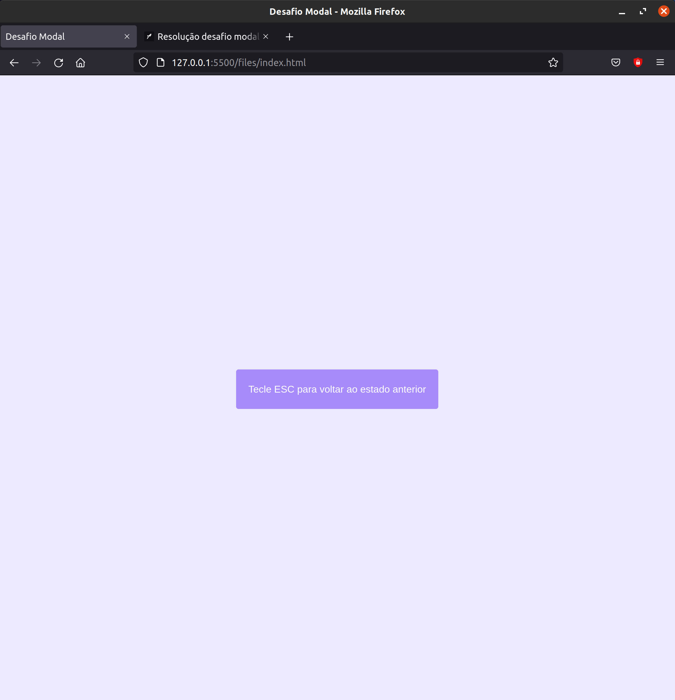

# Desafio Rockeseat Pilotando com o DOM (Modal)
## desafio do curso "Discover"

 Desafio: criar uma função de click do mouse que tira uma classe ('invisble') de um elemento do html via javascript (exemplo: tornar uma div invisivel em visivel retirando uma de suas classes.), depois retorna ao estado anterior adicionando ao elemento uma class ('invisible') usando o 'keydown' para detectar o uso da tecla 'ESC'.

### Start

### End

